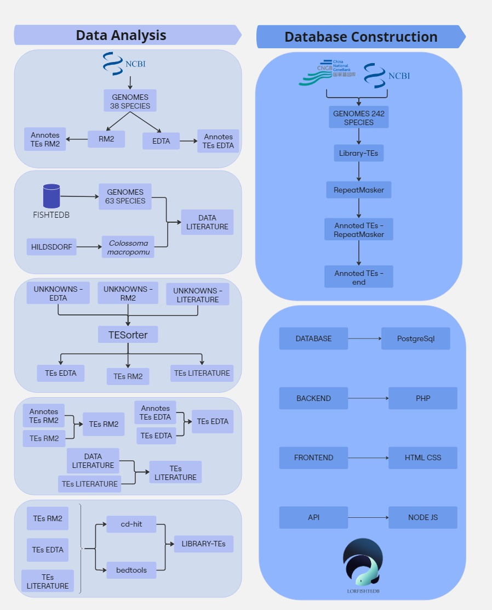

# LORFISHTEDB 🐟💾  
**Banco de Dados de Elementos Transponíveis**  

## 📌 Sobre o Projeto  
LORFISHTEDB é um banco de dados especializado em elementos transponíveis (TEs) de genomas de peixes. O projeto integra dados de diferentes fontes, utiliza ferramentas de anotação e análise bioinformática, e disponibiliza os resultados em uma interface acessível.

## 📜 Fluxograma do Processo  
  

## 📂 Estrutura do Projeto  

### 🔍 Análise de Dados  
- **Fontes de Dados**: NCBI, FISHTEDB, literatura científica  
- **Ferramentas Utilizadas**: RepeatMasker, EDTA, RM2, TEsorter, cd-hit, bedtools  
- **Processamento**: Identificação, anotação e categorização de TEs  

### 🛠 Construção do Banco de Dados  
- **Banco de Dados**: PostgreSQL  
- **Backend**: PHP  
- **Frontend**: HTML + CSS  
- **API**: Node.js  
